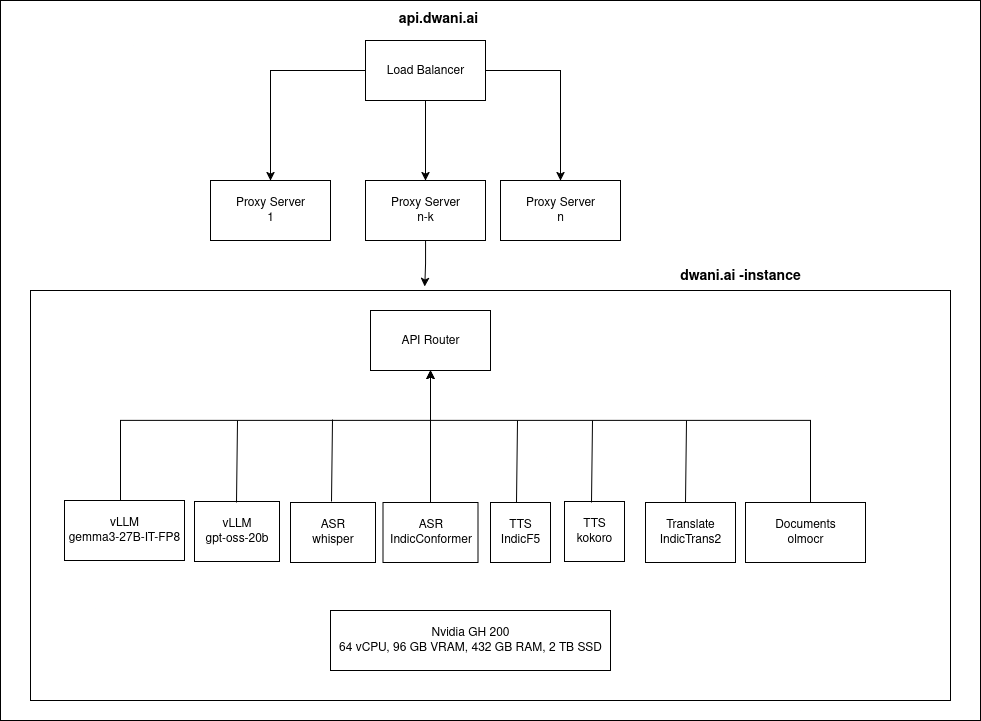

# deploy - dwani.ai

 

Setup dwani.ai - Multimodal Inference API

- [vllm server](docs/vllm_setup.md) - text + images
- [docs-api-server](docs/docs_setup.md) - Documents : extraction, translaition, query
- [api-server](docs/api_server_setup.md) - Swagger setup
- [proxy-server](docs/proxy_setup_vm.md) - Load balancer

- Depends on
  - Text + Vision
    - google/gemma-3-27b-it
    - google/gemma-3-12b-it
    - google/gemma-3-4b-it
  - Text
    - Qwen/Qwen3-32B
    - Qwen/Qwen3-14B
  - Vision
    - vikhyatk/moondream2
  - Speech Synthesis/ Text to Speech
    - ai4bharat/IndicF5
    - onnx-community/Kokoro-82M-v1.0-ONNX
  - Translation
    - ai4bharat/IndicTrans3-beta
    - ai4bharat/indictrans2-indic-indic-1B
    - ai4bharat/indictrans2-en-indic-1B
    - ai4bharat/indictrans2-indic-en-1B
  - Automatic Speech Recognition/ Speech Transcription
    - ai4bharat/indic-conformer-600m-multilingual
    - Systran/faster-whisper-large-v3
  - Text Analysis
    - ai4bharat/Cadence

<!-- 

- API Server 
    - sudo docker run  --env-file .env_api_server -p 80:80 dwani/api-server:latest
    - Create A Record in Cloudflare DNS and point to Static IP from GCP 

-->