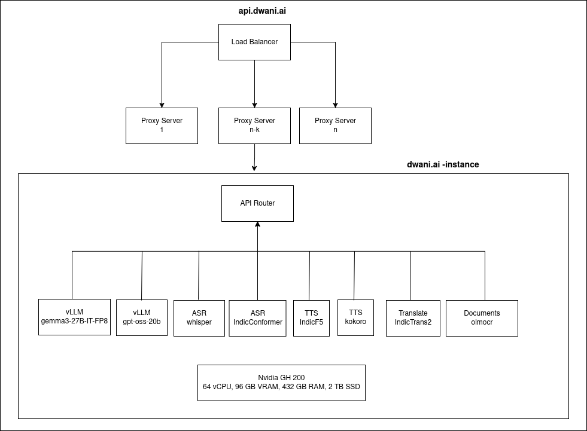

# dwani.ai - Discovery

**dwani.ai** provides secure AI document analytics tailored for proprietary data.

[Try it now at app.dwani.ai](https://app.dwani.ai){ .md-button .md-button--primary }

---

## Overview

dwani.ai empowers users with the following features:

- **Text and Image Inference**: Process and analyze text and images with state-of-the-art models.
- **Document Processing**: Extract, translate, and query documents efficiently.
- **Speech Processing**: Automatic Speech Recognition (ASR) and Text-to-Speech (TTS) for Indian + European languages.
- **Translation**: Seamless translation across major Indian + European languages.
- **Scalability**: Load balancing and API orchestration for robust performance.

---

## System Architecture

The dwani.ai engine is designed for modularity and scalability. Below is a high-level overview of the inference pipeline:

{ align=center }

---

## Component Setup - Discovery

Each component is modular and can be set up independently. Refer to the linked guides for detailed setup instructions.

| Component         | Description                          | Setup Guide                                      |
|-------------------|--------------------------------------|--------------------------------------------------|
| **vLLM Server**   | Text and image inference             | [vLLM Deployment](discovery/vllm_deploy.md)                |
| **API Server**    | API gateway & Swagger setup          | [API Server Setup](discovery/api_server_setup.md)          |
| **Discovery Server**    | Discovery Server          | [Discovery Setup](discovery/discovery_setup.md)          |
| **Proxy Server**  | Load balancer                        | [Proxy Server Setup](discovery/proxy_setup_vm.md)          |

---

## Component Setup - Multimodal Inference

For multimodal inference, the following components are available. Each is independently configurable.

| Component            | Description                              | Setup Guide                                      |
|----------------------|------------------------------------------|--------------------------------------------------|
| **Docs API Server**  | Document extraction, translation, query  | [Docs API Setup](multimodal/docs_setup.md)       |
| **Translate Server** | Indian language translation              | [Translate Server](multimodal/translate_server.md) |
| **TTS Server**       | Text-to-Speech (Indian languages)        | [TTS Server](multimodal/tts-server.md)           |
| **ASR Server**       | Automatic Speech Recognition             | [ASR Server](multimodal/asr_server.md)           |

---

## Model Dependencies

The following models power Dwani.ai's functionality:

| Task                          | Models Used                                                                 |
|-------------------------------|-----------------------------------------------------------------------------|
| **Text + Vision**             | `google/gemma-3-27b-it`, `google/gemma-3-12b-it`, `google/gemma-3-4b-it`   |
| **Text**                      | `Qwen/Qwen3-32B`, `Qwen/Qwen3-14B`                                        |
| **Vision**                    | `vikhyatk/moondream2`                                                     |
| **Speech Synthesis (TTS)**    | `ai4bharat/IndicF5`, `onnx-community/Kokoro-82M-v1.0-ONNX`                |
| **Translation**               | `ai4bharat/IndicTrans3-beta`, `ai4bharat/indictrans2-indic-indic-1B`, etc. |
| **Automatic Speech Recognition (ASR)** | `ai4bharat/indic-conformer-600m-multilingual`, `Systran/faster-whisper-large-v3` |
| **Text Analysis**             | `ai4bharat/Cadence`                                                       |

---

## Contributing

We welcome contributions! Please open issues or submit pull requests to improve dwani.ai.

[Contribute on GitHub](https://github.com/dwani-ai){ .md-button }

---

## License

This project is licensed under the [MIT License](LICENSE).

---

*Built with ❤️ by the dwani.ai team*